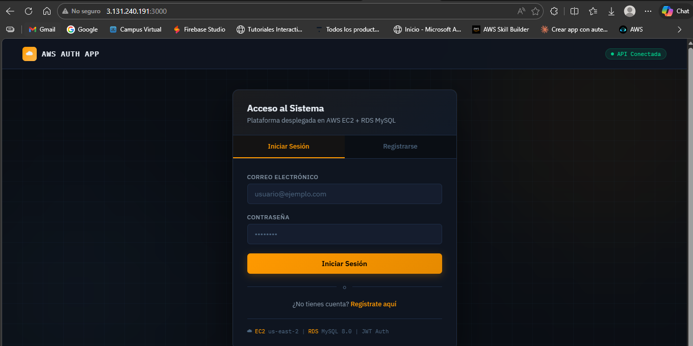

# 🚀 App de Autenticación en AWS

API REST de autenticación con JWT desarrollada con Node.js.

---

## 📸 Demo

---

## 🏗️ Arquitectura

- EC2 (Amazon Linux 2023 + Node.js 18)
- RDS MySQL 8.0
- IAM Role
- Elastic IP

---

## ⚙️ Tecnologías

Express · MySQL2 · bcryptjs · jsonwebtoken · PM2

---

## 🔌 Endpoints

| Método | Ruta | Descripción |
|--------|------|-------------|
| POST | /register | Registro de usuario |
| POST | /login | Login + JWT |

---

## 🧪 Ejemplo de uso

### Registro

POST /register

{
  "email": "test@test.com",
  "password": "123456"
}

---

### Login

POST /login

Respuesta:

{
  "token": "JWT_TOKEN"
}

---

## 🔐 Configuración

Crear archivo `.env`:

DB_HOST=
DB_USER=
DB_PASSWORD=
DB_NAME=
JWT_SECRET=
PORT=3000

---

## ▶️ Ejecutar

npm install
npm start

---

## 👨‍💻 Autor

Alexis Valencia  
https://github.com/Alexisv07/app-auth-aws
