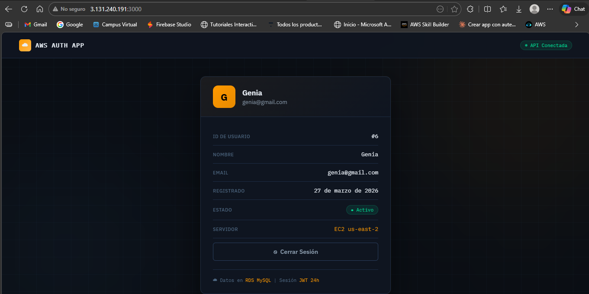
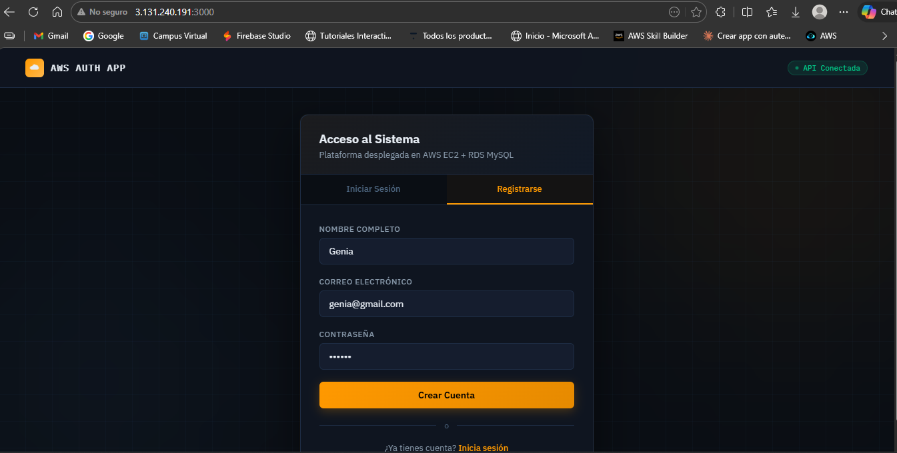
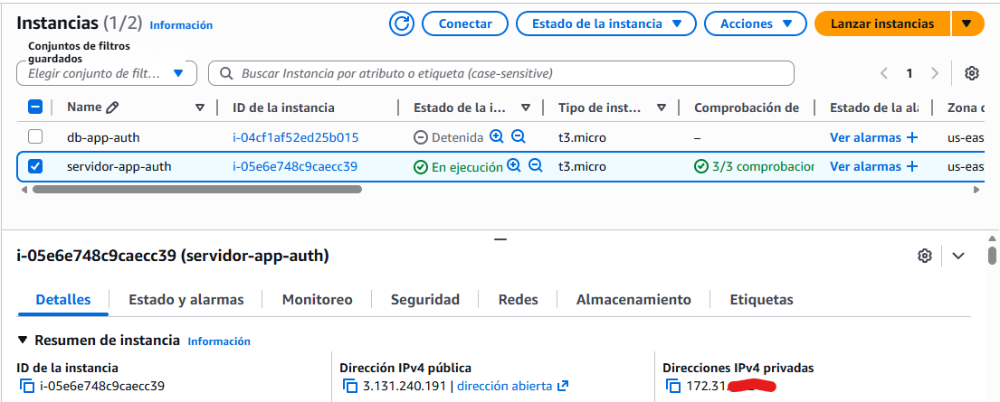
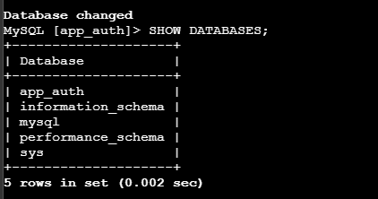
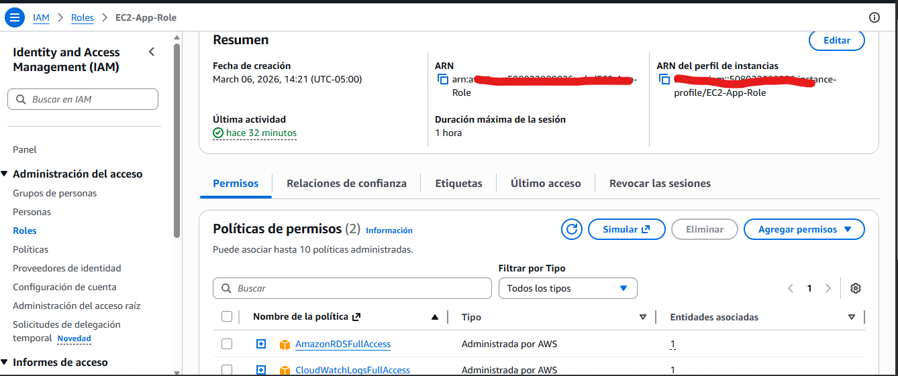
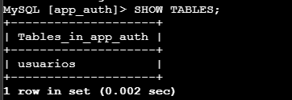
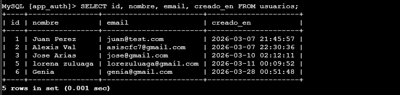

# App de Autenticación en AWS

API REST de autenticación con JWT desplegada en AWS.

## Demo

## Arquitectura
- **EC2** (Amazon Linux 2023 + Node.js 18)
- **RDS** MySQL 8.0 (capa privada)
- **IAM** Role con mínimos privilegios
- **Elastic IP** 3.131.240.191

## Tecnologías
Express · MySQL2 · bcryptjs · jsonwebtoken · PM2

## Endpoints
| Método | Ruta | Descripción |
|--------|------|-------------|
| POST | /register | Registro de usuario |
| POST | /login | Login + JWT |

## Configuración
Copia `.env.example` a `.env` y completa tus credenciales.
